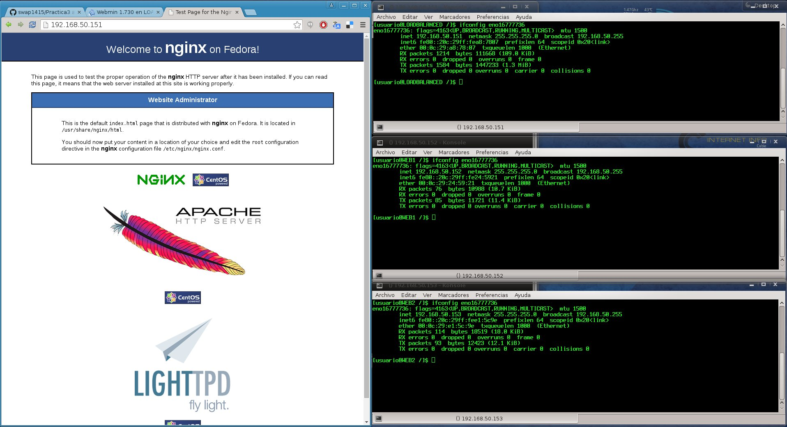
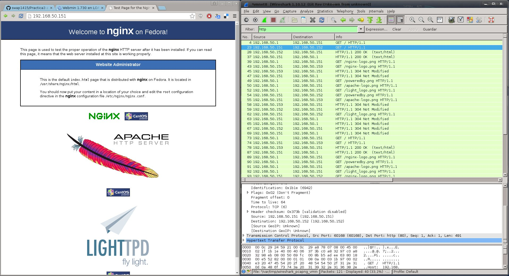

Practica 3 
==========
*Configurando Nginx y HaProxy como balanceadores de carga*

### Objetivos
En esta practica se pretende simular un granja web con un balanceador de carga y dos servidores finales, que aunque sean dos maquinas iguales, configuraremos la primera como si tuviera el doble de capacidad que la segunda.

### Pasos realizados
> * Paso 1 <br />
> Lo primero que realice fue la configuración de una de las maquinas servidoras de paginas web, con todos los parámetros relevantes en un servidor apache. <br />
> * Paso 2 <br />
> El siguiente paso fue instalar PHP, y preparar el servidor para que se pudiera utilizar phpMyAdmin para gestionar las bases de datos. De momento configure una base de datos local para poder realizar la configuración del servidor. <br />
> * Paso 3 <br />
> Después clone la maquina resultado para poder tener las dos maquinas que me servirían las paginas web de mi granja, por supuesto tuve que realizar algunos cambios en la configuración de la segunda maquina para que no hubiera conflictos de IP ni de resolución de nombres. <br />
> * Paso 4 <br />
> Una vez que ya tenia las maquinas listas prepare una tercera maquina que sería la que nos serviría de balanceador de carga, en esta maquina instalé nginx y haproxy, con sus ficheros de configuración. <br />

### Ficheros de Configuración finales

* **nginx.conf**
```bash
events {
    worker_connections  1024;
}

http {
     upstream apaches {
          ip_hash;
          server 192.168.50.156 max_fails=3 fail_timeout=5s;
          server 192.168.50.157;
          keepalive 3;
     }
     server{
         listen 80;
         server_name m3lb;
         access_log /var/log/nginx/m3lb.access.log;
         error_log /var/log/nginx/m3lb.error.log;
         root /var/www/;
         location /
         {
             proxy_pass http://apaches;
             proxy_set_header Host $host;
             proxy_set_header X-Real-IP $remote_addr;
             proxy_set_header X-Forwarded-For $proxy_add_x_forwarded_for;
             proxy_http_version 1.1;<br />
             proxy_set_header Connection "";
         }
     }
}
```

* **httpd.conf** en los dos servidores
```bash
ServerRoot "/etc/httpd"
Listen *:80
Include conf.modules.d/*.conf
User apache
Group apache
ServerAdmin root@localhost
<Directory />
    AllowOverride none
    Require all granted
</Directory>
DocumentRoot "/var/www/html"
<Directory "/var/www">
    AllowOverride None
    Require all granted
</Directory>
<Directory "/var/www/html">
    Options Indexes FollowSymLinks
    AllowOverride None
    Require all granted
</Directory>
<IfModule dir_module>
    DirectoryIndex index.html
</IfModule>
<Files ".ht*">
    Require all denied
</Files>
ErrorLog "logs/error_log"
LogLevel warn
<IfModule log_config_module>
    LogFormat "%h %l %u %t \"%r\" %>s %b \"%{Referer}i\" \"%{User-Agent}i\"" combined
    LogFormat "%h %l %u %t \"%r\" %>s %b" common
    <IfModule logio_module>
      LogFormat "%h %l %u %t \"%r\" %>s %b \"%{Referer}i\" \"%{User-Agent}i\" %I %O" combinedio
    </IfModule>
    CustomLog "logs/access_log" combined
</IfModule>
<IfModule alias_module>
    ScriptAlias /cgi-bin/ /var/www/cgi-bin/
</IfModule>
<Directory "/var/www/cgi-bin">
    AllowOverride None
    Options None
    Require all granted
</Directory>
<IfModule mime_module>
    TypesConfig /etc/mime.types
    AddType application/x-compress .Z
    AddType application/x-gzip .gz .tgz
    AddType text/html .shtml
    AddOutputFilter INCLUDES .shtml
</IfModule>
AddDefaultCharset UTF-8
EnableSendfile on
IncludeOptional conf.d/*.conf
ServerTokens Minor
```
### Comprobamos que funciona correctamente el balanceo
Aunque en la pagina de test de nuestro servidor aparezcan logotipos de otro servidor, nuestros servidores de paginas web son Apache y el servidor de balanceo de carga es Nginx <br />
 <br />
<br />
### Conclusiones
En esta practica he aprendido como de manera fácil y barata podemos montar nuestra granja web y asegurarme de que el el *uptime* de mi sitio web sea *casi del 100%* gracias a los dos servidores de paginas web.