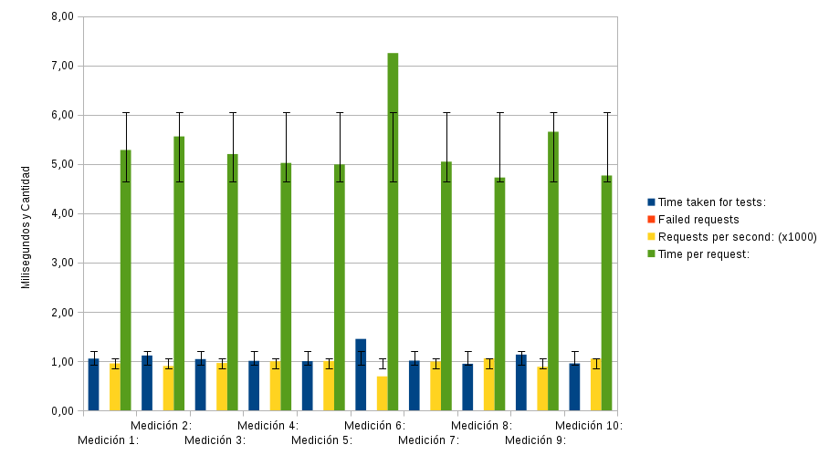

Practica 4 
==========
*Realizando mediciones para comprobar el rendimiento*

### Objetivos
En esta practica vamos a comprobar el rendimiento que tiene nuestra granja web, para ello utilizaremos tres programas diferentes para realizar test de diferentes tipos de estrés para nuestra granja.

### Pasos realizados

 

### Tablas de Valores
|  **SERVIDOR WEB – AB – APACHE**              |                       |                 |                              |                   | 
|----------------------------------------------|-----------------------|-----------------|------------------------------|-------------------| 
|                                              | **Time taken for tests** | **Failed requests** | **Requests per second (x1000)** | **Time per request** | 
| Medición 1:                                  | 0,695                 | 0,00            | 1,44                         | 3,477             | 
| Medición 2:                                  | 0,690                 | 0,00            | 1,45                         | 3,448             | 
| Medición 3:                                  | 0,675                 | 0,00            | 1,48                         | 3,373             | 
| Medición 4:                                  | 0,685                 | 0,00            | 1,46                         | 3,426             | 
| Medición 5:                                  | 0,696                 | 0,00            | 1,44                         | 3,482             | 
| Medición 6:                                  | 0,672                 | 0,00            | 1,49                         | 3,359             | 
| Medición 7:                                  | 0,694                 | 0,00            | 1,44                         | 3,472             | 
| Medición 8:                                  | 0,699                 | 0,00            | 1,43                         | 3,496             | 
| Medición 9:                                  | 0,686                 | 0,00            | 1,46                         | 3,431             | 
| Medición 10:                                 | 0,681                 | 0,00            | 1,47                         | 3,405             | 
| Media:                                       | 0,687                 | 0,00            | 1,46                         | 3,437             | 
| Desviación:                                  | 0,009                 | 0,00            | 0,02                         | 0,047             | 

| **BALANCEADOR DE CARGA – AB – NGINX – APACHE** |                     |                 |                              |                   |
|----------------------------------------------|-----------------------|-----------------|------------------------------|-------------------|
|                                              | **Time taken for tests** | **Failed requests** | **Requests per second (x1000)** | **Time per request** | 
| Medición 1:                                  | 0,877                 | 0,00            | 1,14                         | 4,384             | 
| Medición 2:                                  | 1,063                 | 0,00            | 0,94                         | 5,314             | 
| Medición 3:                                  | 0,855                 | 0,00            | 1,17                         | 4,273             | 
| Medición 4:                                  | 0,876                 | 0,00            | 1,14                         | 4,382             | 
| Medición 5:                                  | 0,807                 | 0,00            | 1,24                         | 4,036             | 
| Medición 6:                                  | 0,832                 | 0,00            | 1,20                         | 4,159             | 
| Medición 7:                                  | 0,798                 | 0,00            | 1,25                         | 3,989             | 
| Medición 8:                                  | 0,842                 | 0,00            | 1,19                         | 4,209             | 
| Medición 9:                                  | 0,831                 | 0,00            | 1,20                         | 4,155             | 
| Medición 10:                                 | 1,407                 | 0,00            | 0,71                         | 7,033             | 
| Media:                                       | 0,92                  | 0,00            | 1,12                         | 4,593             | 
| Desviación:                                  | 0,187                 | 0,00            | 0,17                         | 0,935             | 

| **BALANCEADOR DE CARGA – AB – HAPROXY – APACHE** |                   |                 |                              |                   |
|----------------------------------------------|-----------------------|-----------------|------------------------------|-------------------|
|                                              | **Time taken for tests** | **Failed requests** | **Requests per second (x1000)** | **Time per request** | 
| Medición 1:                                  | 1,050                 | 0,00            | 0,95                         | 5,284             | 
| Medición 2:                                  | 1,112                 | 0,00            | 0,90                         | 5,559             | 
| Medición 3:                                  | 1,040                 | 0,00            | 0,96                         | 5,202             | 
| Medición 4:                                  | 1,004                 | 0,00            | 1,00                         | 5,022             | 
| Medición 5:                                  | 0,998                 | 0,00            | 1,00                         | 4,991             | 
| Medición 6:                                  | 1,450                 | 0,00            | 0,69                         | 7,251             | 
| Medición 7:                                  | 1,009                 | 0,00            | 0,99                         | 5,047             | 
| Medición 8:                                  | 0,945                 | 0,00            | 1,06                         | 4,726             | 
| Medición 9:                                  | 1,131                 | 0,00            | 0,88                         | 5,655             | 
| Medición 10:                                 | 0,953                 | 0,00            | 1,05                         | 4,766             | 
| Media:                                       | 1,07                  | 0,00            | 0,95                         | 5,350             | 
| Desviación:                                  | 0,147                 | 0,00            | 0,11                         | 0,733             | 

|    **SERVIDOR WEB - HTTPERF** |           |         |         |                     |               |
|----------------------|--------------------|---------|---------|---------------------|---------------| 
|              | **Tiempo de Conexión**     |         |         | **Tiempo de Respuesta** |           | 
|                      | Mínimo             | Media   | Máximo  | Respuesta           | Transferencia | 
| Medición 1:          | 0,50               | 1,00    | 13,10   | 0,60                | 0,20          | 
| Medición 2:          | 0,50               | 0,90    | 16,00   | 0,50                | 0,20          | 
| Medición 3:          | 0,50               | 0,90    | 15,90   | 0,50                | 0,20          | 
| Medición 4:          | 0,50               | 1,00    | 13,10   | 0,50                | 0,20          | 
| Medición 5:          | 0,60               | 0,80    | 15,40   | 0,50                | 0,20          | 
| Medición 6:          | 0,60               | 0,90    | 15,00   | 0,60                | 0,20          | 
| Medición 7:          | 0,50               | 70,30   | 100,50  | 0,50                | 0,20          | 
| Medición 8:          | 0,60               | 0,80    | 15,40   | 0,50                | 0,20          | 
| Medición 9:          | 0,60               | 0,90    | 18,30   | 0,50                | 0,20          | 
| Medición 10:         | 0,60               | 0,90    | 15,00   | 0,50                | 0,20          | 
| Media:               | 0,55               | 7,84    | 23,77   | 0,52                | 0,20          | 
| Desviación:          | 0,05               | 21,95   | 27,00   | 0,04                | 0,00          | 

### Gráficas
Las gráficas que se muestran a continuación llevan el mismo orden que las tablas anteriores  
  

### Conclusiones
Incluso con servidores virtuales si la granja tiene una buena infraestructura de red, puede dar un servicio muy aceptable en el momento que se introduce el concepto de balanceo de carga.