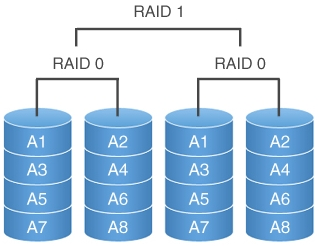
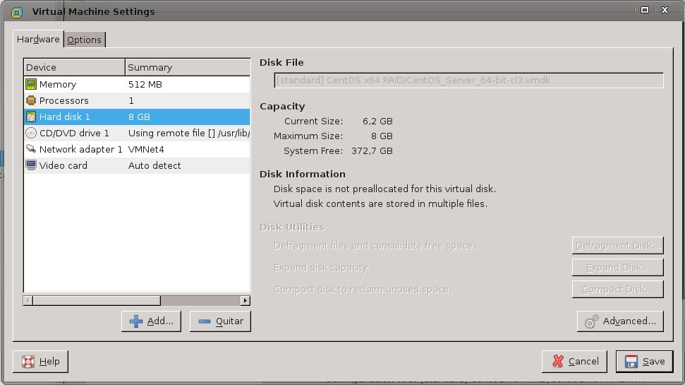
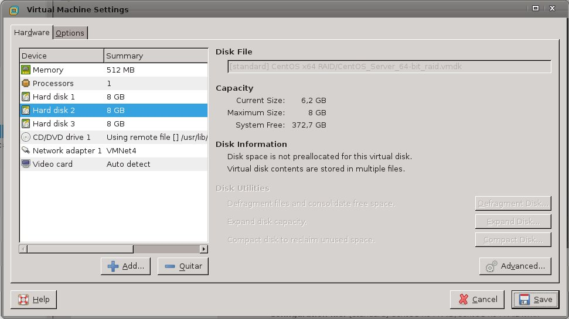

Practica 6 
==========
*Replicando datos en dos discos duros*

### Objetivos
En esta práctica configuraremos dos discos en RAID 1 por software, usando una
maquina virtual con Centos 7.1. Esta configuración RAID ofrece una gran
seguridad al replicar los datos en los dos discos.


## Pasos realizados
> * Paso 1 <br />
> Tenemos que añadir a la maquina virtual los discos duros virtuales que nos van a servir para realizar el RAID 1 de discos. <br />
> * Paso 2 <br />
> Una vez que hemos añadido los discos tenemos que hacer que nuestro sistema operativo los reconozcan para que podamos montar el RAID1. <br />
> * Paso 3 <br />
> En este paso es cuando realmente se monta el RAID1 de discos. <br />
> * Paso 4 <br />
> En este paso es cuando le damos formato al disco para poder utilizarlo para almacenar datos, una vez que hemos dado formato a nuestro disco ya podemos montarlo en el sistema para poder usarlo. <br />

### Paso 1
Comprobamos la instalación de nuestro sistema:

### Paso 2
Añadimos los discos duros:

### Paso 3

### Paso 4

## Operaciones Adicionales
Hasta aquí ya tendriamos completada la tarea para poder usar dos discos en modo espejo, pero claro esta esta opción, solo nos es valida para cuando queremos utilizar el disco como almacenamiento de datos.
Si queremos que nuestro sistema operativo este almacenado en un sistema raid por software tenemos dos maneras, o bien, lo realizamos cuando hacemos la instalación de nuestro sistema, o bien, despues de realizar las operaciones anteriores pasamos nuestras particiones de sistema, a las particiones del sistema RAID1 y para poder realizr esto lo hacemos de la siguiente manera:<br />


### Configuración Manual
Hasta aquí hemos conseguido que la replicación de datos sea consistente pero bastante primitiva, puesto que necesitamos de tareas programadas para que se realice el proceso o bien a un técnico que se encargue de monitorizar la copia de datos entre los dos servidores. <br />
Lo que vamos a intentar ahora es configurar los dos servidores para que actúen como maestro/esclavo, (DB1/DB2), para que la replica de datos sea casi automática. <br />

**Fichero de configuración en DB1**
```bash
[usuario@DB1 /]# cat /etc/my.cnf
# bind-address          = 127.0.0.1
server-id               = 1 # identificador del servidor
report_host             = 192.168.50.159 # ip del servidor cuando actúa como esclavo
log_bin                 = /var/log/mariadb/mariadb-bin 
log_bin_index           = /var/log/mariadb/mariadb-bin.index
relay_log               = /var/log/mariadb/relay-bin
relay_log_index         = /var/log/mariadb/relay-bin.index
replicate-do-db         = contactos # solo se replicará esta base de datos
...
[usuario@DB1 /]# mysql --host=localhost --user=root --password=contraseña --database="contactos" --execute="create user 'replicauser'@'%' identified by 'contraseña'"
[usuario@DB1 /]# mysql --host=localhost --user=root --password=contraseña --database="contactos" --execute="grant replication slave on *.* to 'replicauser'@'%'"
```

<pre><code>
[usuario@DB2 /]# mysql --host=localhost --user=root --password=contraseña --database="contactos" --execute="stop slave"
[usuario@DB2 /]# mysql --host=localhost --user=root --password=contraseña --database="contactos" --execute="change master to master_host='<b>192.168.50.159</b>', MASTER_USER='replicauser', MASTER_PASSWORD='contraseña', MASTER_LOG_FILE='mariadb-bin.000001', MASTER_LOG_POS=245"
[usuario@DB2 /]# mysql --host=localhost --user=root --password=contraseña --database="contactos" --execute="start slave"
[usuario@DB2 /]# mysql --host=localhost --user=root --password=contraseña --database="contactos" --execute="unlock tables"
</code></pre>

### Bibliografía
> Página web de MariaDB: https://mariadb.com/kb/en/mariadb/replication-cluster-multi-master/ <br />
> Comandos mas usados: https://mariadb.com/kb/en/mariadb/replication-commands/ <br />
> Parametros de configuración de replica: https://mariadb.com/kb/en/mariadb/replication-and-binary-log-server-system-variables/ <br />

### Conclusiones
Bueno la primera parte de la practica, se supone que es mas fácil por que es algo que ya hemos visto en las anteriores, aun así hay que tener cuidado a la hora de utilizar los comandos de copia entre servidores para clonar las configuraciones de ambos por que, si no vamos con cuidado podemos copiar la configuración mala, en el servidor con la configuración buena.<br />
Aparte de eso es bastante sencillo poder crear una copia del servidor completo por si al maestro le sucediera algo. Después la segunda parte de la practica se complica un poco mas, pero esta claro que es la configuración que tenemos que realizar para cuando tenemos servidores en producción, puesto que de esta forma no bloqueamos la inserción de datos mientras estamos realizando una copia de seguridad en el otro servidor, pero claro que esto también tiene la pega, de que si nos equivocamos, y borramos registros sin querer hacerlo, también se borran en el otros servidor, por lo tanto hay que tener claro que aunque tengamos, replicados los datos para posibles contingencias frente a fallos, también hay que realizar copias de seguridad programadas.