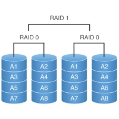

Practica 6 
==========
*Replicando datos en dos discos duros*

### Objetivos
En esta práctica configuraremos dos discos en RAID 1 por software, usando una
maquina virtual con Centos 7.1. Esta configuración RAID ofrece una gran
seguridad al replicar los datos en los dos discos.


## Pasos realizados
> * Paso 1 <br />
> Tenemos que añadir a la maquina virtual los discos duros virtuales que nos van a servir para realizar el RAID 1 de discos. <br />
> * Paso 2 <br />
> Una vez que hemos añadido los discos tenemos que hacer que nuestro sistema operativo los reconozcan para que podamos montar el RAID1. <br />
> * Paso 3 <br />
> En este paso es cuando realmente se monta el RAID1 de discos. <br />
> * Paso 4 <br />
> En este paso es cuando le damos formato al disco para poder utilizarlo para almacenar datos, una vez que hemos dado formato a nuestro disco ya podemos montarlo en el sistema para poder usarlo. <br />

### Paso 1
Comprobamos la instalación de nuestro sistema:<br />

### Paso 2
Añadimos los discos duros: <br />

### Paso 3
Ejecutamos los siguientes comandos: <br />
```bash
[usuario@server /]$ sudo fdisk -l
[sudo] password for usuario:

Disk /dev/sda: 8590 MB, 8590983168 bytes, 16779264 sectors
Units = sectors of 1 * 512 = 512 bytes
Sector size (logical/physical): 512 bytes / 512 bytes
I/O size (minimum/optimal): 512 bytes / 512 bytes
Disk label type: dos
Identificador del disco: 0x0008bbde
                                                                                                                                                       
Disposit. Inicio    Comienzo      Fin      Bloques  Id  Sistema
/dev/sda1   *        2048     1026047      512000   83  Linux
/dev/sda2         1026048    16779263     7876608   8e  Linux LVM

Disk /dev/sdc: 8589 MB, 8589934592 bytes, 16777216 sectors
Units = sectors of 1 * 512 = 512 bytes
Sector size (logical/physical): 512 bytes / 512 bytes
I/O size (minimum/optimal): 512 bytes / 512 bytes
Disk label type: dos
Identificador del disco: 0x0004d31c

Disposit. Inicio    Comienzo      Fin      Bloques  Id  Sistema

Disk /dev/sdb: 8589 MB, 8589934592 bytes, 16777216 sectors
Units = sectors of 1 * 512 = 512 bytes
Sector size (logical/physical): 512 bytes / 512 bytes
I/O size (minimum/optimal): 512 bytes / 512 bytes
Disk label type: dos
Identificador del disco: 0x000c5e20

Disposit. Inicio    Comienzo      Fin      Bloques  Id  Sistema

Disk /dev/mapper/centos-swap: 859 MB, 859832320 bytes, 1679360 sectors
Units = sectors of 1 * 512 = 512 bytes
Sector size (logical/physical): 512 bytes / 512 bytes
I/O size (minimum/optimal): 512 bytes / 512 bytes


Disk /dev/mapper/centos-root: 5242 MB, 5242880000 bytes, 10240000 sectors
Units = sectors of 1 * 512 = 512 bytes
Sector size (logical/physical): 512 bytes / 512 bytes
I/O size (minimum/optimal): 512 bytes / 512 bytes


Disk /dev/mapper/centos-home: 1958 MB, 1958739968 bytes, 3825664 sectors
Units = sectors of 1 * 512 = 512 bytes
Sector size (logical/physical): 512 bytes / 512 bytes
I/O size (minimum/optimal): 512 bytes / 512 bytes

[usuario@server /]$ sudo mdadm --create /dev/md0 --level=raid1 --raid-devices=2 --metadata=1.0 /dev/sdb1 /dev/sdc1
[sudo] password for usuario:
mdadm: array /dev/md0 started.
[usuario@server /]$ sudo mdadm --create /dev/md1 --level=raid1 --raid-devices=2 /dev/sdb2 /dev/sdc2
mdadm: array /dev/md1 started.

```
Como podemos ver desde la salida de consola podemos ver que aparte de los dos discos (sdb, sdc)que hemos añadido a nuestro sistema también, tiene hay un tercer disco que contiene una partición LVM, con tres particiones que contienen, home, root, swap, así después de ver esto lo que vamos a intentar es pasar todas las particiones a nuestro disco RAID1.

### Paso 4
Le damos formato a nuestro disco para poder pasar los datos pero como vamos a usarlo de una manera muy particular ponemos los mismos tamaños que tiene las particiones home, root y swap que tiene nuestro disco origen. <br />
Como hemos hecho 2 particiones y cada una de ellas tiene un formato diferente puesto que una de ellas la vamos a usar para el arranque del sistema tenemos que utilizar diferentes comandos para formatear las unidades RAID. <br />

```bash
[usuario@server /]$ sudo mkfs.xfs -b size=512 -L raid_boot -f /dev/md0p1

[usuario@server /]$ sudo pvcreate /dev/md0p2 --> *physical volumen create*
[usuario@server /]$ sudo vgcreate raid /dev/md0p2  --> *volumen group create*
[usuario@server /]$ sudo lvcreate -L 4,9G -n raid_root raid  --> *logical volumen create*
[usuario@server /]$ sudo lvcreate -L 792M -n raid_swap raid  --> *logical volumen create*
[usuario@server /]$ sudo lvcreate -L 1,82G -n raid_home raid --> *logical volumen create*
```

## Operaciones Adicionales
Para probar las características del sistema de discos RAID 1, lo que vamos ha hacer a continuación es simular que cuando se reinicia nuestro servidor uno de los discos del RAID deja de funcionar.


### Conclusiones
Bueno la primera parte de la practica, se supone que es mas fácil por que es algo que ya hemos visto en las anteriores, aun así hay que tener cuidado a la hora de utilizar los comandos de copia entre servidores para clonar las configuraciones de ambos por que, si no vamos con cuidado podemos copiar la configuración mala, en el servidor con la configuración buena.<br />
Aparte de eso es bastante sencillo poder crear una copia del servidor completo por si al maestro le sucediera algo. Después la segunda parte de la practica se complica un poco mas, pero esta claro que es la configuración que tenemos que realizar para cuando tenemos servidores en producción, puesto que de esta forma no bloqueamos la inserción de datos mientras estamos realizando una copia de seguridad en el otro servidor, pero claro que esto también tiene la pega, de que si nos equivocamos, y borramos registros sin querer hacerlo, también se borran en el otros servidor, por lo tanto hay que tener claro que aunque tengamos, replicados los datos para posibles contingencias frente a fallos, también hay que realizar copias de seguridad programadas.